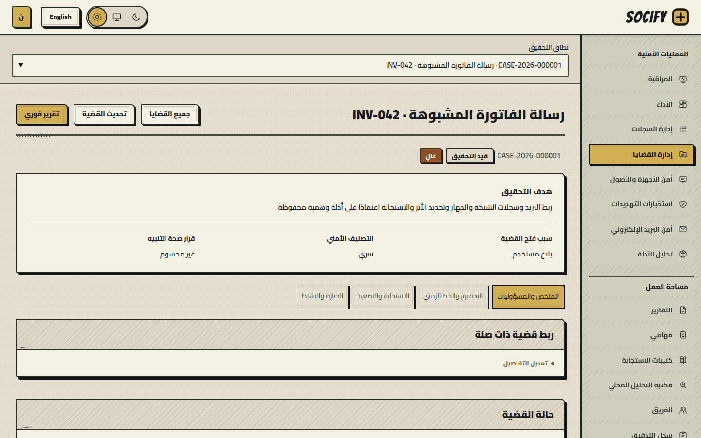
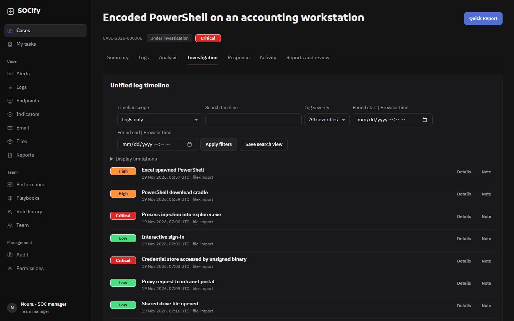
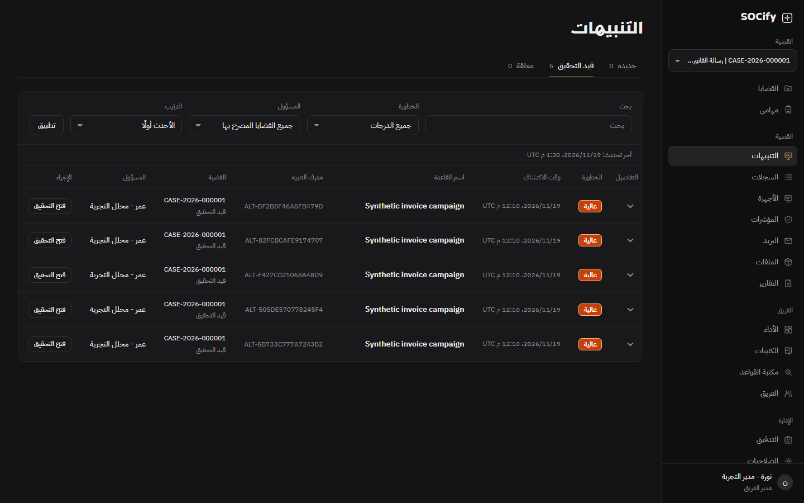
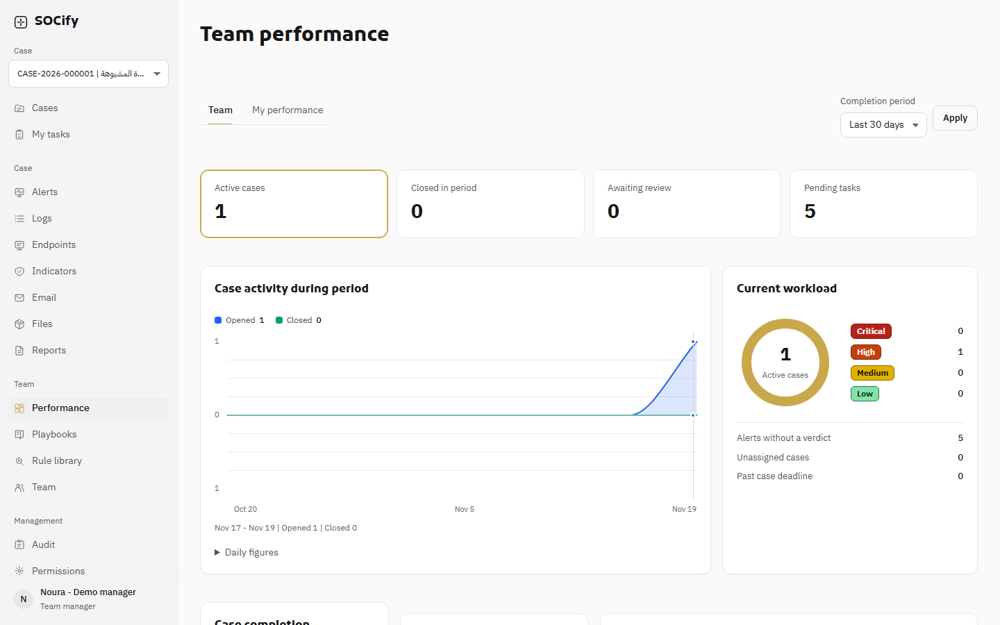

<h1 align="center"></h1>

<p align="center">
  <a href="https://github.com/7zy4/SOCifyProject/actions/workflows/enterprise-quality.yml"></a>
  <a href="CHANGELOG.md"></a>
  <a href="LICENSE"></a>
  
</p>

<p align="center"><em>Case-centred incident investigation for SOC teams: from raw logs to an approved report. Arabic and English interface, self-hosted with Docker.</em></p>

<div dir="rtl">

**SOCify** منصة لفرق مراكز العمليات الأمنية تجمع التحقيق في الحادثة من أوله إلى آخره: ترفع السجلات، وتراجع التنبيهات مع أدلتها، وتوثّق القرارات والمهام، ثم تصدر تقرير القضية جاهزًا للاعتماد. الواجهة بالعربية والإنجليزية، بوضعين فاتح وداكن، وتعمل على الكمبيوتر والجوال.

<p align="center">
  <a href="#التشغيل">التشغيل</a> ·
  <a href="docs/features.md">المميزات</a> ·
  <a href="docs/analyst-guide.md">دليل المحلل</a> ·
  <a href="docs/operations.md">دليل التشغيل</a> ·
  <a href="SECURITY.md">الأمان</a> ·
  <a href="CHANGELOG.md">سجل التغييرات</a>
</p>

<table>
  <tr>
    <td width="50%"><p align="center">ملخص القضية وفريقها ومهامها</p></td>
    <td width="50%"><p align="center">الخط الزمني الموحد للسجلات</p></td>
  </tr>
  <tr>
    <td width="50%"><p align="center">المراقبة وفرز التنبيهات</p></td>
    <td width="50%"><p align="center">أداء الفريق والفرد</p></td>
  </tr>
  <tr>
    <td colspan="2" align="center"><p align="center">تقرير القضية القابل للطباعة وحفظه PDF</p></td>
  </tr>
</table>

## ما تقدمه المنصة

| المرحلة | ما تنجزه |
|---|---|
| إدخال البيانات | معاينة الملفات، ضبط الحقول والوقت، استيراد السجلات أو استقبالها من موصل قضية |
| الكشف والفرز | قواعد كشف، تنبيهات مرتبطة بأدلتها، بحث وترشيح، وتوثيق نتيجة المراجعة |
| التحقيق | خط زمني، أصول ومؤشرات، علاقات، فرضيات، أسباب جذرية، وربط MITRE ATT&CK |
| التحليل | تحليل الشبكة ونتائج الأجهزة المستوردة، وفحص ساكن للملفات والبريد وقواعد YARA المحلية |
| الاستجابة | مهام ومسؤولون، كتيبات استجابة، تصعيد، مهل عمل، وإجراءات تصحيحية |
| المراجعة والتقرير | تقرير محفوظ بأدلته، مراجعة واعتماد، تصدير PDF وDOCX وHTML وMarkdown وJSON |
| إدارة الفريق | دعوات وأدوار وصلاحيات، إسناد العمل، رسوم أداء الفريق والفرد، وسجل تدقيق |

- التحليل مرتبط ببيانات القضية، وإجراءات الاستجابة توثّق ما نفذه الفريق؛ المنصة لا تتصل بالأجهزة لتنفيذ أوامر أو عزلها.
- استخبارات التهديدات وGeoIP وتقارير السمعة تُستورد محليًا. سحب السجلات عبر HTTPS يحتاج مصدرًا مصرحًا وإعداد الشبكة.
- الصيغ المدعومة ونطاق كل خدمة في [قائمة المميزات](docs/features.md).

## التشغيل

يكفي [Docker](https://docs.docker.com/get-docker/) مع Compose: Docker Desktop على Windows وmacOS، أو Docker Engine على Linux. نفّذ الأوامر من مجلد المشروع.

**1. أنشئ مفتاحي التشغيل** مرة واحدة. يُحفظان في ملف `.env` بجانب `docker-compose.yml`، ولا يُرفع هذا الملف إلى المستودع.

<div dir="ltr">

PowerShell (Windows):

```powershell
$k = { $b = New-Object byte[] 48; [Security.Cryptography.RandomNumberGenerator]::Create().GetBytes($b); [Convert]::ToBase64String($b).TrimEnd('=').Replace('+','-').Replace('/','_') }
"SOCIFY_SECRET_KEY=$(& $k)`nSOCIFY_CREDENTIAL_KEY=$(& $k)" | Out-File -Encoding ascii .env
```

Bash (Linux وmacOS):

```bash
key() { openssl rand -base64 48 | tr '+/' '-_' | tr -d '=\n'; }
printf 'SOCIFY_SECRET_KEY=%s\nSOCIFY_CREDENTIAL_KEY=%s\n' "$(key)" "$(key)" > .env && chmod 600 .env
```

</div>

> **مهم:** احتفظ بنسخة آمنة من `.env`. المفتاح الثاني يشفّر الأدلة والتقارير، ومن دونه لا يمكن فتحها.

**2. شغّل المنصة.** البناء الأول يستغرق بضع دقائق.

<div dir="ltr">

```bash
docker compose up -d --build
```

</div>

**3. أنشئ حساب مدير الفريق.** يطلب الأمر كلمة المرور.

<div dir="ltr">

```bash
docker compose exec socify python -m scripts.bootstrap_team --email you@example.com --name "Owner" --team "SOC"
```

</div>

**4. افتح <http://127.0.0.1:5000>** وسجّل الدخول. أنشئ قضية، وارفع سجلاتها (في `fixtures/import` عينات جاهزة مثل `linux-auth.log`)، ثم راجع التنبيهات وأكمل التحقيق حتى اعتماد التقرير. يضيف المدير بقية الفريق بدعوات من صفحة الفريق.

| تريد أن | الأمر |
|---|---|
| توقف المنصة مع بقاء البيانات | `docker compose down` |
| تحدّث إلى إصدار أحدث | `git pull` ثم `docker compose up -d --build` |
| ترى حالة الخدمات | `docker compose ps` |

- لا تستخدم `docker compose down -v`: الخيار يحذف حجم البيانات.
- النسخ الاحتياطي والاستعادة وتدوير المفاتيح والنشر خلف HTTPS في [دليل التشغيل](docs/operations.md).
- لتجربة المنصة ببيانات جاهزة دون تثبيت شيء، افتح Codespace من المستودع واتبع [دليل Codespaces](docs/codespaces.md#عرض-ببيانات-جاهزة).

## الأمان

- التسجيل بدعوة من مدير الفريق فقط، والدعوة وحدها تحدد الفريق والدور.
- مصادقة ثنائية، وحماية CSRF، وسياسة محتوى صارمة (CSP)، وجلسات قابلة للإلغاء.
- الأدلة والتقارير وبيانات الاعتماد مشفّرة في القاعدة، مع إمكان تدوير المفتاح دون فقد الأدلة.
- فحص الملفات يجري في حاوية تحليل معزولة بلا شبكة ولا وصول إلى القاعدة.
- كل إجراء على القضية مسجّل في سجل تدقيق وسلسلة حيازة للأدلة.

للإبلاغ عن ثغرة اتبع [سياسة الأمان](SECURITY.md). التفاصيل في [دليل الأمان](docs/security-guide.md) و[نموذج التهديد](docs/threat-model.md).

## الأدلة

| احتياجك | الدليل |
|---|---|
| معرفة الخدمات والصيغ | [المميزات](docs/features.md) |
| إنجاز تحقيق وتقرير | [دليل المحلل](docs/analyst-guide.md) |
| توزيع العمل وقراءة الأداء | [إدارة الفريق](docs/teams.md) |
| التشغيل والنسخ والاستعادة | [دليل التشغيل](docs/operations.md) |
| بيئة تجربة خاصة في GitHub | [Codespaces](docs/codespaces.md) |
| معالجة مشكلة | [استكشاف الأعطال](docs/troubleshooting.md) |
| الربط مع أنظمة أخرى | [مواصفات API](docs/api/openapi.yaml) |

## التقنيات


| التقنية | الاستخدام |
|---|---|
| [Python](https://www.python.org/) و[Flask](https://flask.palletsprojects.com/) | التطبيق وواجهات التكامل |
| [SQLite](https://www.sqlite.org/) | البيانات والمعاملات والبحث النصي FTS5 |
| [Docker](https://www.docker.com/) | عزل الخدمات والتحليل |
| [Gunicorn](https://gunicorn.org/) و[NGINX](https://nginx.org/) | تشغيل التطبيق ومدخل النشر |
| [WeasyPrint](https://weasyprint.org/) و[python-docx](https://python-docx.readthedocs.io/) | إخراج التقارير |
| [YARA](https://virustotal.github.io/yara/) | مطابقة قواعد فحص الملفات محليًا |

## هيكل المشروع

<div dir="ltr">

```text
SOCifyProject/
├── socify/                 # التطبيق: الحسابات، الاستيراد، الكشف، التحقيق، التقارير
├── templates/              # صفحات الواجهة
├── static/                 # التنسيق والتفاعل والخطوط والهوية
├── data/                   # كتالوج MITRE ATT&CK المحلي
├── scripts/                # أوامر التشغيل: الحسابات، العمال، النسخ، الاستعادة، تدوير المفاتيح، العرض
├── deploy/                 # إعداد مدخل NGINX
├── docs/                   # أدلة الاستخدام والتشغيل والأمان ومواصفات API
├── fixtures/               # عينات سجلات للتجربة
├── app.py                  # نقطة دخول خدمة التطبيق
├── Dockerfile              # صور التطبيق والتحليل والمدخل
└── docker-compose.yml      # ربط الخدمات ومساحات التخزين
```

</div>

## الترخيص

المشروع مرخّص بـ[MIT](LICENSE). تراخيص المكونات والخطوط والبيانات في [إشعارات الأطراف الثالثة](THIRD_PARTY_NOTICES.md).

</div>
